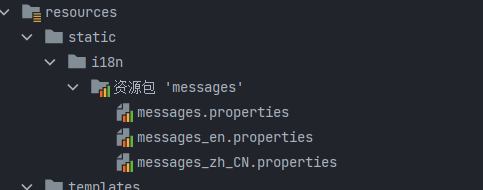

# Thymeleaf学习

官网文档：https://www.thymeleaf.org

## 什么是Thymeleaf？

Thymeleaf 是一个现代服务器端 Java 模板引擎 ，

## 工作方式

模板引擎获取模板并将模板的符号替换成我们的数据

## Thymeleaf入门

### 1.创建一个maven项目

### 2.导入pom坐标

```xml
<dependency>
    <groupId>junit</groupId>
    <artifactId>junit</artifactId>
    <version>4.11</version>
    <scope>test</scope>
</dependency>

<dependency>
    <groupId>org.thymeleaf</groupId>
    <artifactId>thymeleaf</artifactId>
    <version>3.0.15.RELEASE</version>
</dependency>
```

### 3.创建于一个测试类

```java
    @Test
    public void testThymeleaf2() {
        //创建模板引擎
        TemplateEngine engine = new TemplateEngine();
        String input = "<input type='text' th:value='${name}'/>";
        //准备数据，使用Context
        Context context = new Context();
        context.setVariable("name", "wang");
        //调用引擎金，处理模板和数据
        String out = engine.process(input, context);
        System.out.println(out);
    }
```

我们发现模板引擎会对字符串模板的特定语法进行解析

### 4.将一个html文件当作模板

在类路径下创建一个html文件

```html
<!DOCTYPE html>
<html lang="en">
<head>
    <meta charset="UTF-8">
    <title>Title</title>
</head>
<body>
<input type='text' th:value='${name}'/>
</body>
</html>
```

```java
@Test
public void testThymeleaf3() {
    //创建模板引擎
    TemplateEngine engine = new TemplateEngine();
    //读取磁盘中的模板文件,会自动去加载类路径下的文件
    ClassLoaderTemplateResolver resolver=new ClassLoaderTemplateResolver();
    //将模板数据交给引擎
    engine.setTemplateResolver(resolver);
    //准备数据，使用Context
    Context context = new Context();
    context.setVariable("name", "wang");
    //调用引擎金，处理模板和数据
    String out = engine.process("index.html", context);
    System.out.println(out);
}
```

我们发现模板引擎也会对文件中模板的特定语法进行解析

### 5.自定义文件位置，以及文件前缀和后缀

在类路径下创建一个templates的文件夹统一管理模板

```java
@Test
public void testThymeleaf4() {
    //创建模板引擎
    TemplateEngine engine = new TemplateEngine();
    //读取磁盘中的模板文件,会自动去加载类路径下的文件
    ClassLoaderTemplateResolver resolver=new ClassLoaderTemplateResolver();
    //设置文件前缀
    resolver.setPrefix("/templates/");
    //设置文件后缀
    resolver.setSuffix(".html");
    //将模板数据交给引擎
    engine.setTemplateResolver(resolver);
    //准备数据，使用Context
    Context context = new Context();
    context.setVariable("name", "wang");
    //调用引擎金，处理模板和数据
    String out = engine.process("main", context);
    System.out.println(out);
}
```

为了自定义模板位置，和减少文件的重复性操作

## SpringBoot整合

### 1.导入pom坐标

```xml
  <dependency>
        <groupId>org.springframework.boot</groupId>
        <artifactId>spring-boot-starter-thymeleaf</artifactId>
    </dependency>
    <dependency>
        <groupId>org.springframework.boot</groupId>
        <artifactId>spring-boot-starter-web</artifactId>
    </dependency>

    <dependency>
        <groupId>org.projectlombok</groupId>
        <artifactId>lombok</artifactId>
        <optional>true</optional>
    </dependency>
    <dependency>
        <groupId>org.springframework.boot</groupId>
        <artifactId>spring-boot-starter-test</artifactId>
        <scope>test</scope>
        <exclusions>
            <exclusion>
                <groupId>org.junit.vintage</groupId>
                <artifactId>junit-vintage-engine</artifactId>
            </exclusion>
        </exclusions>
    </dependency>
</dependencies>
```

### 2.设置配置文件

```yaml
server:
  port: 8080
spring:
  application:
    name: SpringBoot-Thymeleaf
  thymeleaf:
    # 开启模板缓存（默认值： true ）v
    cache: false
    # 检查模板是否存在，然后再呈现
    check-template: true
    # 检查模板位置是否正确（默认值 :true ）
    check-template-location: true
    #Content-Type 的值（默认值： text/html ）
    content-type: text/html
    # 开启 MVC Thymeleaf 视图解析（默认值： true ）
    enabled: true
    # 模板编码
    encoding: UTF-8
    # 要被排除在解析之外的视图名称列表，⽤逗号分隔
    excluded-view-names:
    # 要运⽤于模板之上的模板模式。另⻅ StandardTemplate-ModeHandlers( 默认值： HTML5)
    mode: HTML
    # 在构建 URL 时添加到视图名称前的前缀（默认值： classpath:/templates/ ）
    prefix: classpath:/templates/
    # 在构建 URL 时添加到视图名称后的后缀（默认值： .html ）
    suffix: html
```

### 3.创建controller目录和控制层类

```java
@Controller
@RequestMapping("/wang")
public class HelloController {
    /**
     * @Description: Model可以存放数据，最终存放在request作用域
     * @Param: [model]
     * @Return: java.lang.String 表示试图
     * @Author: Wang
     * @Date: 2022/5/2 16:47
    */
    @RequestMapping("/hello")
    public String hello(Model model){
      //添加数据
        model.addAttribute("name","wang");
        return "index";
    }

    @RequestMapping("/http")
    public String hello(HttpServletRequest httpServletRequest){
        //添加数据
        httpServletRequest.setAttribute("name","request");
        return "index";
    }
}
```

### 4.启动服务，进行访问

## Thymeleaf语法

### 表达式分类

##### 变量表达式：`${...}`

```java
 html:  
<p th:text="${name}"></p>
<p th:text="${user.id}"></p>
<p th:text="${user.age}"></p>
<p th:text="${user.address}"></p>
<p th:text="${user.name}"></p>
 java:   
   @RequestMapping("/test1")
    public String hello(Model model){
      //添加简单属性
        model.addAttribute("name","wang");
        //添加对象属性
        User user = new User();
        user.setId(5);
        user.setName("wang");
        user.setAge(18);
        user.setAddress("杭州");
        model.addAttribute("user",user);
        //对象类型的属性值
        return "var1";
    }

```

##### 选择变量表达式：`*{...}`


##### 消息表达式：`#{...}`

###### 1.国际化使用

第一步：添加配置

```properties
spring
  messages:
  # 国际化资源文件路径
    basename: static/i18n/messages       
```

第二部：创建文件



第三步：通过改变浏览器默认语言可达到切换的目的

第四步：通过按钮控制切换

自定义解析器

```java
public class MyLocaleResolver implements LocaleResolver {
    @Override
    public Locale resolveLocale(HttpServletRequest httpServletRequest) {
        String th=httpServletRequest.getParameter("l");
        Locale locale=Locale.getDefault();
        if(!StringUtils.isEmpty(th)){
            String[]  spit=th.split("_");
            locale=new Locale(spit[0],spit[1]);
        }
        return locale;
    }

    @Override
    public void setLocale(HttpServletRequest httpServletRequest, HttpServletResponse httpServletResponse, Locale locale) {

    }
```

交给spring容器

```java
@Configuration
public class ApplocationConfig {
    @Bean
    public LocaleResolver localeResolver(){
        return new MyLocaleResolver();
    }

}
```

##### 链接 URL 表达式：`@{...}`

###### 1.基本使用：

```html
localhost:/exp/link
<a th:href="@{var1}">跳转连接</a>  跳转到当前目录html文件   localhost:/exp/var1
<a th:href="@{./var1}">跳转连接</a>  跳转到当前目录html文件 localhost:/exp/var1 
<a th:href="@{../user/var1}">跳转连接</a>  跳转到上一级目录html文件 localhost:/user/var1
<a th:href="@{/user/var1}">跳转连接</a>  直接从根目录改变
<a th:href="@{http://www.baidu.com}">跳转连接</a>  直接跳转指定地址
```

###### 2.链接中传值

```html
传一个参数
<a th:href="@{./var1(id=1001)}">跳转连接</a>  跳转到当前目录html文件 localhost/exp/var1?id=1001
传多个参数,一个是常量，一个是来自数据
<a th:href="@{./var1(id=1001，name=${name})}">跳转连接</a>  跳转到当前目录html文件 
```

用于跳转路径

引入外部文件css js img 

##### 片段表达式：`~{...}`

### 标准表达式

#### 文本

文本文字只是在单引号之间指定的字符串，它们可以包含任何字符，如果字符中没有空格，可以不加单引号。使用“+”连接文本，也可以使用“|”连接文本

```html
<p th:text="学习模板">文本数据</p>
<p th:text="'hello thymeleaf'">Hello Thymeleaf</p>
<p th:text="'宝马'+'良驹'">战马</p>
<p th:text="'学习'+${info}">学习java</p>
<p th:text="true">boolean文本</p>
<p th:text="123">数字也可以看作文本数据</p>
<p th:text="|欢迎使用${info}|">文本数据</p>
<p th:text="您好+|${n1},${n2}|">文本数据</p>
```

#### 数字

```html
<p th:text="55">显示数字</p>
<p th:text="6+6">显示数字的和</p>
<p th:text="6+6+'后面是字符'+10+20">前面是数字相加，后面是字符串拼接</p>
<p th:text="6+6+'这回不一样'+(10+20)">都做了加法</p>
<p th:text="${n1}-${n2}">服务端数据</p>
<p th:text="100-${n1}">字面数据减去服务端数据</p>
```

#### 布尔

```html
<p th:if='表达式得到一个布尔值'></p>，布尔值为true显示，反之不显示
```

#### null和""

null字面量吗，在页面直接使用，也可以判断数据是否为null.当数据为null，标签和内容不显示。“”字符串和null的处理结果一样

#### 比较/逻辑运算符

```html
<th:if='10 >5'>，布尔值为true显示，反之不显示
```

#### 三元运算符

```html
<p th:text="10 >5 ?'10大于5':'10小于5'">
<p thtext="${n1} >${n2} ?'n1大于n2':'n1小于n2'"></p>    
```

### 设置属性值

**th:text**    计算其值表达式将结果设置为标签的标签内容

**th:utext**   th:text会对结果中的特殊字符转义，th:utext不会转义

**th:attr**        为标签中的任意属性设置属性值

```html
<form action="/hello.html" th:attr="action=${myaction}">   替换掉原有属性的值
</form>
也可以选择更具体的标签
th:value
th:text
th:onclck
等大部分html标签都有
```

**th:alt-title**  同时为alt与tiele属性赋值

**th:lang-xmllang** 同时为lang、xml：lang属性赋值

**th:each**  迭代数据，如数组 List Map等

```java
后端
Model model= new Model();
List<Students> list=new List<>();
list.add(new Students(1,"wang",18));
list.add(new Students(2,"wang",18));
list.add(new Students(3,"wang",18));
list.add(new Students(4,"wang",18));
model.addAttribute("students",list)
return model;
前端：
<tr th:each="mystu:${students}">
<td th:text={mystu.id}></td>
<td th:text={mystu.name}></td>
<td th:text={mystu.age}></td>
</tr>
```

**th:if** 条件为true时，显示模板元素，否则不显示

**th:unless**  条件为false时显示模板元素，否则不显示

**th:switch**  与java中的switch语句等效，有条件的显示匹配内容

**th:case**  配黑th:switch使用

**th:with**  定义局部变量

**th:inline** 禁用内联样式，内联js,内联css

### 模板使用

模板就是公用资源，可以多次重复使用的内容。经常把页眉，页脚菜单做成模板，在各个其他页面使用

使用方式：先定义，在使用。可以在当前页面和其他页面中使用


**th:fragment** 定义模板片段

**th:insert** 将引用的模板片段插入到自己的标签中

**th:replace** 将被引用的模板片段插入到自己的标签体中

**th:include** 类似于th:insert ，而不是出入片段它值插入此片段的内容

**th:remove**  删除模板中的某些代码片段

模板定义：

```html
<div th:fragment="模板名称">
    模板内容
</div>
```

引用模板：

```html
1.把模板插入到当前位置
<div insert="模板文件名称::模板名称">
    其他内容
</div>
2.把模板替换当前标签内容
<div replace="模板文件名称::模板名称">
    其他内容
</div>
3.把模板添加到当前位置（已淘汰）
<div include="模板文件名称::模板名称">
    其他内容
</div>
4.模板删除
1）all 删除包含标签及其所有子项

```


